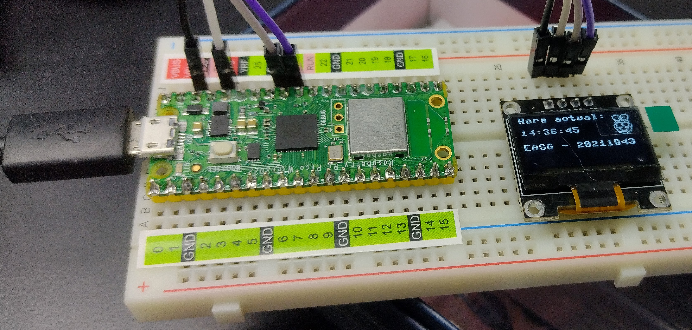

# Hora



## Código
```python
from machine import Pin, I2C
from ssd1306 import SSD1306_I2C
import machine
import utime
import framebuf  # Agrega esta importación para FrameBuffer

# Configuración de la pantalla OLED y pines I2C
pix_res_x = 128
pix_res_y = 64
scl_pin = 27
sda_pin = 26

# Representación en bytes de tus imágenes en mapa de bits
# Asegúrate de que cada imagen sea 32x32 píxeles (el tamaño que mencionaste)
# Reemplaza los valores a continuación con tus propias imágenes
plain1_bytes = [
    0xff, 0xfe, 0x7f, 0xff, 0xff, 0xfd, 0xbf, 0xff, 0xff, 0xfd, 0xbf, 0xff, 0xff, 0xe1, 0x87, 0xff, 
	0xff, 0xfd, 0xbf, 0xff, 0xfe, 0x6f, 0xf6, 0x7f, 0xfd, 0xb7, 0xed, 0xbf, 0xe5, 0xbb, 0xdd, 0xa7, 
	0xd9, 0xbd, 0xbd, 0x9b, 0xde, 0xfd, 0xbf, 0x7b, 0xe7, 0xdd, 0xbb, 0xe7, 0xf3, 0xcd, 0xb3, 0xcf, 
	0xef, 0xf1, 0x8f, 0xf7, 0xfe, 0x3d, 0xbc, 0x7f, 0xe1, 0xdf, 0xfb, 0x87, 0xff, 0xf7, 0xef, 0xff, 
	0xff, 0xf7, 0xef, 0xff, 0xe1, 0xdf, 0xfb, 0x87, 0xff, 0x3d, 0xbc, 0xff, 0xef, 0xf1, 0x8f, 0xf7, 
	0xf3, 0xcd, 0xb3, 0xcf, 0xe7, 0xdd, 0xbb, 0xe7, 0xde, 0xfd, 0xbf, 0x7b, 0xd9, 0xbd, 0xbd, 0x9b, 
	0xe5, 0xbb, 0xdd, 0xa7, 0xfd, 0xb7, 0xed, 0xbf, 0xfe, 0x6f, 0xf6, 0x7f, 0xff, 0xfd, 0xbf, 0xff, 
	0xff, 0xe1, 0x87, 0xff, 0xff, 0xfd, 0xbf, 0xff, 0xff, 0xfd, 0xbf, 0xff, 0xff, 0xfe, 0x7f, 0xff
]

plain2_bytes = [
    0xff, 0x87, 0xc3, 0xff, 0xff, 0x1f, 0xf1, 0xff, 0xfe, 0x7f, 0xfc, 0xff, 0xfc, 0xff, 0xfe, 0x7f, 
	0xf9, 0xe7, 0xef, 0x3f, 0xfb, 0xe7, 0xc7, 0xbf, 0xf3, 0xe7, 0xc7, 0x9f, 0xf7, 0xc7, 0xc7, 0xdf, 
	0xe7, 0xc7, 0xc7, 0xcf, 0xef, 0xc7, 0xc7, 0xef, 0xef, 0xc7, 0xc7, 0xef, 0xcf, 0xe7, 0xc7, 0xe7, 
	0xcf, 0xe7, 0xc7, 0xe7, 0xdf, 0xe7, 0xef, 0xf7, 0xdf, 0xff, 0xff, 0xf7, 0xdf, 0xff, 0xff, 0xf7, 
	0xd9, 0xff, 0xff, 0x37, 0xdf, 0xff, 0xff, 0xb7, 0xdd, 0xff, 0xff, 0xf7, 0xcd, 0xff, 0xff, 0x67, 
	0xed, 0xff, 0xff, 0x67, 0xed, 0xff, 0xff, 0x6f, 0xee, 0xff, 0xfe, 0xef, 0xe6, 0x7f, 0xfe, 0xcf, 
	0xf7, 0x7f, 0xfd, 0xdf, 0xf3, 0xbf, 0xfb, 0x9f, 0xf9, 0xcf, 0xe7, 0x3f, 0xfd, 0xe0, 0x0f, 0x7f, 
	0xfc, 0xff, 0xfe, 0x7f, 0xfe, 0x3f, 0xf8, 0xff, 0xff, 0x1f, 0xf1, 0xff, 0xff, 0xc0, 0x07, 0xff
];

plain3_bytes = [
    0xff, 0xff, 0xff, 0xff, 0xff, 0xff, 0xff, 0xff, 0xff, 0xff, 0xff, 0xff, 0xff, 0xff, 0xff, 0xff, 
	0xff, 0xfe, 0xff, 0xff, 0xff, 0xfe, 0x7b, 0xff, 0xff, 0xdc, 0x73, 0xff, 0xff, 0xcf, 0x73, 0xff, 
	0xff, 0xf0, 0x0f, 0xdf, 0xf0, 0xe0, 0x03, 0x9f, 0xfc, 0xc0, 0x01, 0x3f, 0xfe, 0x80, 0x01, 0x3f, 
	0xff, 0x80, 0x00, 0xff, 0xff, 0x00, 0x00, 0xff, 0xff, 0x00, 0x00, 0x3f, 0xf9, 0x00, 0x00, 0x0f, 
	0xe1, 0x00, 0x00, 0x1f, 0xf9, 0x00, 0x00, 0xff, 0xff, 0x00, 0x00, 0xff, 0xff, 0x80, 0x00, 0xff, 
	0xfe, 0x80, 0x01, 0x3f, 0xfc, 0xc0, 0x03, 0x1f, 0xf8, 0xe0, 0x07, 0xff, 0xff, 0xf8, 0x0f, 0xff, 
	0xff, 0x8f, 0xf3, 0xff, 0xff, 0x9e, 0x33, 0xff, 0xff, 0xfe, 0x7b, 0xff, 0xff, 0xfe, 0x7f, 0xff, 
	0xff, 0xff, 0xff, 0xff, 0xff, 0xff, 0xff, 0xff, 0xff, 0xff, 0xff, 0xff, 0xff, 0xff, 0xff, 0xff
]

# Crea objetos de frame buffer para las imágenes
image1 = framebuf.FrameBuffer(bytearray(plain1_bytes), 32, 32, framebuf.MONO_HLSB)
image2 = framebuf.FrameBuffer(bytearray(plain2_bytes), 32, 32, framebuf.MONO_HLSB)
image3 = framebuf.FrameBuffer(bytearray(plain3_bytes), 32, 32, framebuf.MONO_HLSB)

def init_i2c(scl_pin, sda_pin):
    # Inicializa el dispositivo I2C
    i2c_dev = I2C(1, scl=Pin(scl_pin), sda=Pin(sda_pin), freq=400000)
    return i2c_dev

def display_text(oled, text, x, y):
    # Limpia la pantalla
    oled.fill(0)
    # Muestra el texto en la posición (x, y)
    oled.text(text, x, y)
    oled.show()

def read_temperature():
    sensor_temp = machine.ADC(4)
    conversion_factor = 3.3 / 65535
    reading = sensor_temp.read_u16() * conversion_factor 
    temperature = 27 - (reading - 0.706) / 0.001721
    return temperature

def main():
    i2c_dev = init_i2c(scl_pin, sda_pin)
    oled = SSD1306_I2C(pix_res_x, pix_res_y, i2c_dev)

    while True:
        temperature = read_temperature()  # Lee la temperatura
        # Limpia la pantalla OLED
        oled.fill(0)
        
        # Seleciona la imagen según la temperatura
        if temperature > 30:
            oled.blit(image3, 48, 16)
        elif 25 <= temperature < 29.9:
            oled.blit(image2, 48, 16)
        else:
            oled.blit(image1, 48, 16)

        
        # Muestra la temperatura en la pantalla OLED
        oled.text('Grados: {:.2f} C'.format(temperature), 10, 0)  # Cambia la coordenada Y para mostrar el texto debajo de la imagen
        oled.show()
        utime.sleep(2)

if __name__ == '__main__':
    main()
```