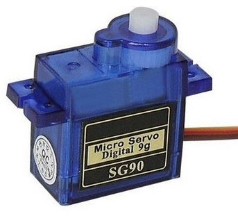

# **SERVOMOTORES**
A continuación se presentara una breve explicación acerca del funcionamiento o funciones del componente eléctrico "servomotor"  

## *¿Qué es un servomotor?*
>Es un actuador rotativo o lineal que permite lograr un control preciso en cuanto a posición angular, aceleración y velocidad del eje, capacidades que un motor normal no tiene.

## *¿Comó esta diceñado un servomotor?*
>Está diseñado para controlar el movimiento de su eje en cuanto a velocidad, aceleración, torque y posición. Debe tener la capacidad para acelerar la inercia del mecanismo, vencer los rozamientos y compensar fuerzas externas tales como la fricción contra un objeto o la gravedad. Por lo tanto, la relación de inercia entre la carga y el servomotor es clave para conseguir un funcionamiento óptimo del sistema.

## *Tipos de Servomotores*
>- Lineales
>- Rotativos
>- Escobillas
>- Sin escobillas (brushless)
>- Corriente alterna (AC)
>- Corriente continua (CC)

## *Componentes basicos*
>- Motor
>- Dispositivo de retroalimentación 
>- Controlador de movimiento
>- Servodrive

## *¿Comó funciona un servomotor?*
> El controlador envía señales de baja tensión referente a la posición y la velocidad que se necesita al servoamplificador, estos comandos son amplificados a una alta potencia para que el motor pueda usarla. Las señales eléctricas del sensor del servomotor se devuelven al amplificador, este amplificador utiliza información para controlar la velocidad y la posición del rotor. La función del servocontrolador es completar el bucle del sistema. Al intercambiar constantemente datos con el servoamplificador, los parámetros del motor, ya sea la velocidad, el par o el torque, se ajustan inmediatamente.

## *Bibliografia:*
 * [Conoce el funcionamiento de los servomotores](https://urany.net/blog/conoce-el-funcionamiento-de-los-servomotores#:~:text=Un%20servomotor%20es%20un%20actuador,un%20motor%20normal%20no%20tiene)
 * [¿Qué es un servomotor? ¿Cómo funciona?](https://www.electronicboard.es/que-es-un-servomotor-como-funciona/#%C2%BFComo_funcionan_los_servomotores)
